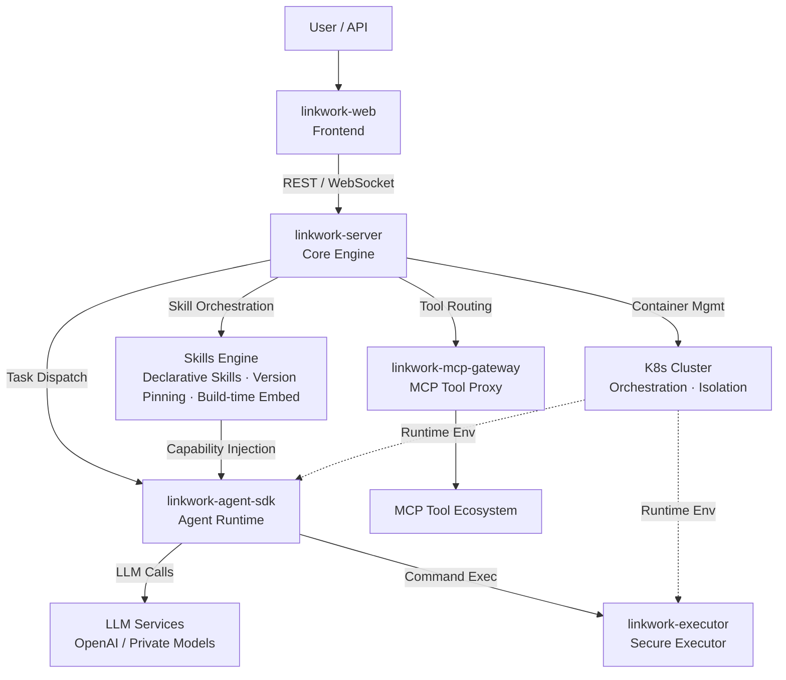

# 🪢 LinkWork

### Make AI Work Like Your Team

**Open-source enterprise AI workforce platform — Roles · Skills · Tools · Security · Scheduling, all in one place**

English | [中文](./README_zh-CN.md)

---

## What Is LinkWork

LinkWork is an open-source **AI worker platform**.

You can run it like a company: create **roles**, equip each role with **skills**, authorize available **tools**, set **security policies**, arrange **task schedules** — then let your AI workers run 24/7 in their own isolated containers, track progress in real time, and automatically intercept high-risk operations for human approval.

Not a chatbot. Not a personal assistant. An **enterprise-grade AI team management system**.

> Before paying AI a salary, give it a role, a skill set, and a security policy.

## Core Design Philosophy

### Every AI Worker Is a Containerized Service

An AI worker isn't a process running on the host machine. Each AI worker runs in an independent **Docker / K8s container** with:

- **Isolated execution environment** — Filesystem, network, and processes fully isolated between workers
- **Dedicated resource quotas** — CPU and memory allocated on demand, preventing any single worker from crashing the cluster
- **Persistent workspace** — Task outputs, intermediate state, and long-term memory preserved across sessions
- **Fixed skill configuration** — Install capabilities like apps — they persist across restarts
- **Policy-controlled command boundaries** — Policy engine governs what each AI worker can and cannot execute

Manage your AI team like a microservice cluster — fully leveraging the K8s cloud-native ecosystem:

- **Smart Scheduling** — Atomic scheduling of multiple AI workers, priority-based resource allocation, queuing when busy, releasing when idle
- **Execution Isolation** — AI reasoning and command execution run separately with clear security boundaries
- **Elastic Scaling** — Auto scale up/down based on task volume, auto-release resources when idle
- **Resource Governance** — Per-role resource quotas, preventing any single worker from consuming excessive cluster resources
- **Self-healing** — Auto-restart on container crash, stale working directories auto-cleaned

### Skills & Tool Marketplace: The App Store for AI Capabilities

LinkWork breaks down AI capabilities into three governable layers, managed like an App Store:

**Role** — A complete AI worker definition
> Includes persona, job description, available Skills list, and tool permissions. Create a "Frontend Engineer" role, and any AI model instance can start working immediately.

**Skills** — Installable capability modules
> Declaratively defined. Each Skill is independently versioned and injected into the container at build time with a pinned version. "Code Review", "Data Analysis", "Document Writing" are independent Skills, mix and match across roles.

**MCP Tool** — Standardized external capability access
> Compatible with the [Model Context Protocol](https://modelcontextprotocol.io/) standard. Database queries, API calls, file operations, browser control — all accessed through a unified tool bus with automatic proxy, auth, and metering.

**Role → Skills → Tool** — three decoupled layers, freely composable, **access-controlled**. Enterprise admins decide which roles can use which Skills and tools, rather than the AI installing whatever it wants.

### AI Supply Chain: Govern AI Capabilities Like a Software Supply Chain

Behind the marketplace is a complete **supply chain governance system** — unified management from build, versioning, discovery, to audit:

- **Image Factory** — Auto-build, security scanning; every role image is traceable and reproducible
- **Skills Factory** — Online editing, version management, team sharing, and usage analytics
- **MCP Factory** — Tool registration and discovery, health checks, auth, and usage metering

## Key Features

- **Containerized Service Orchestration** — Each AI worker runs in its own container, K8s-native scheduling with elastic scaling and self-healing
- **AI Role Management** — Define job responsibilities and capability boundaries; swap workers without changing roles
- **Skills Marketplace** — Declarative Skills, version-pinned and embedded at build time
- **MCP Tool Bus** — Compatible with [MCP protocol](https://modelcontextprotocol.io/) standard, unified proxy, auth, and usage metering
- **Task Orchestration & Real-time Tracking** — Dispatch tasks, watch execution via WebSocket streaming, fully observable
- **Security Approval Workflow** — Risk-tiered policy engine, high-risk operations auto-intercepted, proceed only after human confirmation
- **Scheduled Shifts** — Cron-driven, AI workers execute on schedule without manual triggering
- **Vector Memory** — Long-term memory storage, cross-task knowledge accumulation and semantic retrieval
- **Multi-model Support** — Compatible with OpenAI API standard, freely switch underlying models

## Harness Engineering: One Role, One Image

AI Agent success isn't just about model capability — **execution environment determinism is equally decisive**. LinkWork adopts a **"One Role, One Image"** paradigm: Skills, MCP tools, and security policies are all **baked into the container image at build time**. Runtime is read-only — no drift, no surprises.

### Build-time Immutability, Not Runtime Fetching

Each role build triggers a complete assembly pipeline:

1. **Skills injection** — Pull the corresponding version of Skills per role config, pin exact version into the image
2. **MCP config baking** — Generate MCP tool descriptor files, written read-only into the image
3. **Security policy embedding** — Security policy files packaged into the image, auto-loaded at startup
4. **Version snapshot recording** — Record exact versions of every Skill and MCP tool, making builds fully reproducible

Config change → must rebuild the image. This is a **deliberate design choice**: every running AI worker's environment is fully predictable and reproducible.

### Context Priming

At task startup, the runtime automatically assembles the execution context:

- **Skills sync** — Pre-installed Skills from the image are synced to the working directory and loaded via the standard path
- **Git repo preparation** — Auto-pull code to the task branch per config; AI workers operate directly in real code repositories
- **Three-tier Prompt strategy** — Platform Prompt + Role Prompt + User Soul, building complete task background

AI workers don't start from zero — they **arrive on the job with full environment and context**.

### Fail-fast on Build Failures

Skills configured but Git clone fails → build aborted. MCP configured but generation fails → build aborted. **Never silently skipped** — problems surface at build time, not when an AI worker runs with broken capabilities.

> One Role, One Image: environment as code, versions pinned, builds reproducible, failures exposed early.

## Enterprise-grade Output Guarantees

For enterprises, AI that can "do stuff" isn't enough — outputs must be **deliverable, traceable, and constrained**. LinkWork treats output guarantees as a first-class citizen:

### Structured Delivery

Every task has a clear delivery mode:

- **Git mode** — Auto clone/checkout a working branch before task start, auto commit/push and create Merge Request after completion. Output is code, going through standard Code Review workflows
- **OSS mode** — Output files auto-archived to object storage, structured by `user_id/task_id`, persistently accessible

Not a chat transcript — **engineering deliverables ready to merge and deploy**.

### Full Event Audit Trail

Every LLM call, every command execution, every tool request — all recorded with timestamps. **What the AI did, which Skill it used, which tool it called** — fully traceable, meeting compliance and audit requirements.

### Defense in Depth: Not One Wall, but Multiple Layers

All AI behavioral intents must pass through multiple security layers, each inescapable:

- **Deep Command Analysis** — No simple string matching; the system understands command structure, independently evaluating each sub-command within complex commands. Nesting and disguises are identified and blocked
- **AI Workers Are Completely Unaware of the Security Layer** — The security proxy is invisible to AI; workers believe they're executing commands directly, fundamentally preventing AI from bypassing the security layer
- **Privilege Separation** — Security control processes and AI task processes run independently, invisible and inaccessible to each other
- **Network Default-deny** — AI workers have no external network access by default; only necessary service addresses are whitelisted on demand
- **High-risk Operation Approval** — Dangerous commands are auto-intercepted; proceed only after human confirmation, timeout defaults to deny

> Enterprises don't need AI that "probably works" — they need deliverable, auditable, constrained engineering productivity.

## Architecture

**How it works**: User creates a task → Core engine allocates a container in the K8s cluster → Agent runtime starts in an isolated environment → Calls LLM for reasoning, securely executes commands through the executor → MCP gateway proxies external tool calls → Execution status streams back in real time.

## How It Differs from Personal AI Agents

Projects like OpenClaw are excellent personal AI assistants — running on your laptop, one Agent handling your daily tasks. LinkWork addresses a different level of the problem:

| | Personal AI Assistants (e.g. OpenClaw) | LinkWork |
|---|--------------------------------------|----------|
| **Positioning** | Personal productivity tool | Enterprise workforce platform |
| **Scale** | Single user, single Agent | Multi-team, multiple AI workers in parallel |
| **Runtime Env** | Local single machine | K8s cluster, container isolation |
| **Capability Mgmt** | Community plugins, self-install | Role → Skill → Tool, three-tier governance |
| **Security** | Relies on user discretion | Approval workflow + policy engine + audit |
| **Deployment** | `npm install -g` | Docker Compose / K8s |
| **Skills Reuse** | Personal accumulation, hard to share | Skills proven on personal tools migrate directly in, shared across teams, reliably executed |

> Personal assistants solve "my productivity". LinkWork solves "organizational effectiveness". Skills you've refined on personal tools can go straight into LinkWork, becoming standardized capabilities your entire team can use.

## Components

| Component | Description | Status |
|-----------|-------------|--------|
| **linkwork-server** | Core backend — task scheduling, role management, approvals, Skills & tool registry | Coming soon |
| **linkwork-executor** | Secure executor — in-container command execution, policy engine | Coming soon |
| **linkwork-agent-sdk** | Agent runtime — LLM engine, Skills orchestration, MCP integration | Coming soon |
| **linkwork-mcp-gateway** | MCP tool gateway — tool discovery, auth, usage metering | Coming soon |
| **linkwork-web** | Frontend reference — task dashboard, role config, Skills marketplace | Coming soon |

## Open-source Roadmap

LinkWork follows a **phased open-source** strategy, ensuring each component is independently usable and well-documented:

| Phase | Components | Description | ETA |
|-------|-----------|-------------|-----|
| Phase 1 | linkwork-server | Backend core with full scheduling engine and demo launcher | Late March 2026 |
| Phase 2 | linkwork-executor + linkwork-agent-sdk | Execution layer — secure executor + Agent runtime | Late March 2026 |
| Phase 3 | linkwork-mcp-gateway + linkwork-web | Access layer — MCP tool gateway + frontend reference implementation | End of March 2026 |

> All components are planned to be fully open-sourced before April 1, 2026. Watch this repo for updates.

## License

[Apache License 2.0](./LICENSE)

## Stay Connected

All components are planned to be fully open-sourced before April 1, 2026. If you're interested in enterprise AI workforce management:

- **Star** this repo to track progress
- **Watch** for release notifications
- Feel free to share ideas and suggestions in Issues

---

**LinkWork** — Not just an AI assistant. An AI team.

