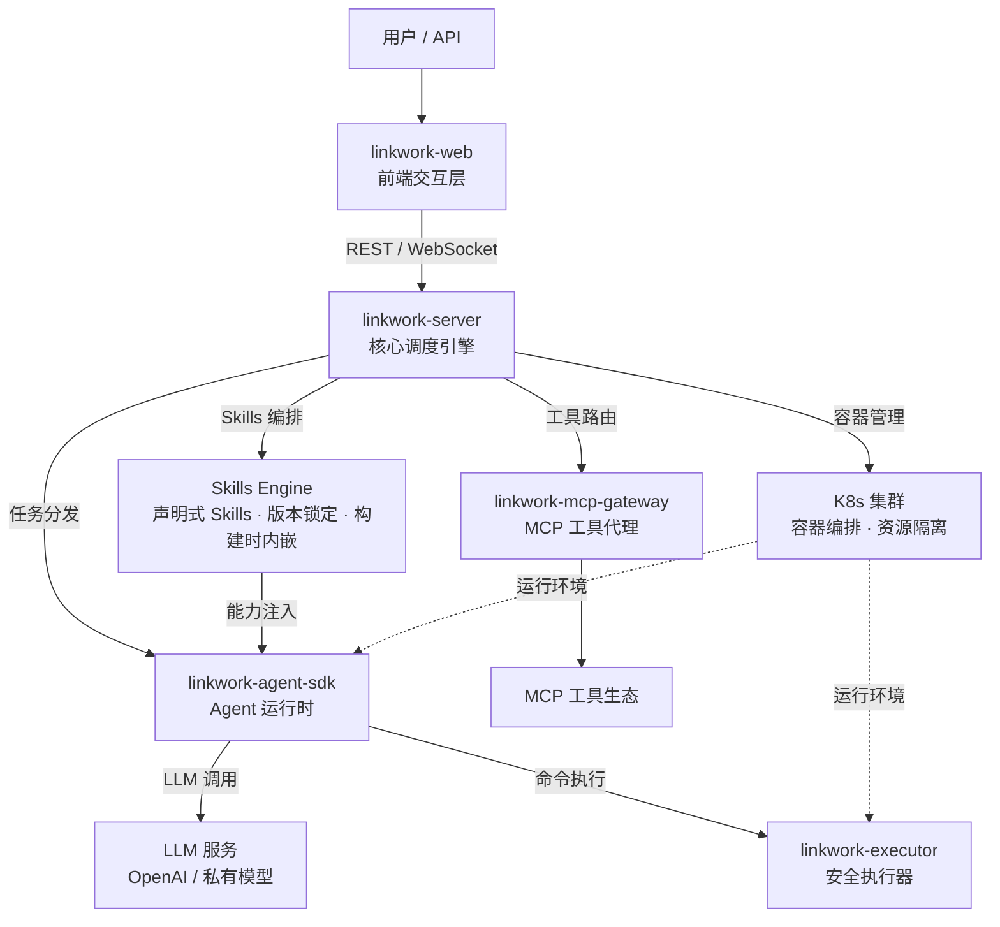

# 🪢 灵工（LinkWork）

### 让 AI 像员工一样工作

**开源的企业级 AI 劳动力平台 — 岗位 · 技能 · 工具 · 安全 · 调度，一站式管理你的 AI 团队**

[English](./README.md) | 中文

---

## 这是什么

LinkWork 是一个开源的 **AI 员工平台**。

你可以像经营一家公司一样管理 AI：设立**岗位**，为每个岗位装配**技能**，授权可用的**工具**，设定**安全策略**，安排**计划任务** — 然后让 AI 员工在各自独立的容器中 7x24 运行，实时追踪进度，高风险操作自动拦截审批。

不是一个聊天机器人，不是一个个人助手，而是一个**企业级的 AI 团队管理系统**。

> 给 AI 发工资之前，先给它一个岗位、一套技能、一条安全红线。

## 核心设计理念

### 每个 AI 员工都是一个容器化服务

AI 员工不是一个跑在宿主机上的进程。每个 AI 员工在独立的 **Docker / K8s 容器**中运行，拥有：

- **隔离的执行环境** — 文件系统、网络、进程完全隔离，员工之间互不干扰
- **专属的资源配额** — CPU、内存按需分配，防止单个员工拖垮整个集群
- **持久化的工作空间** — 任务产出、中间状态、长期记忆跨会话保留
- **固定的技能配置** — 像安装 App 一样为AI员工装配能力，重启不丢失
- **策略化的命令边界** — 策略引擎控制每个AI员工能执行什么、不能执行什么

像管理微服务集群一样管理 AI 团队 — 全面复用 K8s 云原生生态：

- **智能调度** — 多 AI 员工原子化调度，按优先级分配资源，忙时排队、闲时释放
- **执行隔离** — AI 推理与命令执行分离运行，安全边界清晰
- **弹性伸缩** — 按任务量自动扩缩容，空闲时自动释放资源
- **资源治理** — 按岗位设定资源配额，防止单个员工占用过多集群资源
- **故障自愈** — 容器崩溃自动重启，残留工作目录自动清理

### Skills & 工具市场：AI 能力的 App Store

LinkWork 将 AI 能力拆解为三层可治理的模块，像 App Store 一样管理：

**岗位 (Role)** — 一个完整的 AI 员工定义
> 包含人设、职责描述、可用 Skills 列表和工具权限。创建一个"前端开发工程师"岗位，任何 AI 模型实例化后都能直接上岗。

**Skills** — 可装卸的能力模块
> 声明式定义，每个 Skill 独立版本管理，构建时锁定版本注入容器。"代码审查"、"数据分析"、"文档撰写"都是独立 Skill，按需组合安装到不同岗位。

**MCP 工具** — 标准化的外部能力接入
> 兼容 [Model Context Protocol](https://modelcontextprotocol.io/) 标准。数据库查询、API 调用、文件操作、浏览器控制……通过统一的工具总线接入，自动代理、鉴权、计量。

**岗位 → Skills → 工具**，三层解耦、自由组合、**权限可控** — 企业管理员决定哪些岗位可用哪些 Skills 和工具，而不是 AI 自己随意安装。

### AI 供应链：像管理软件供应链一样管理 AI 能力

市场的背后是一套完整的**供应链治理体系** — 从构建、版本、发现到审计，统一管控：

- **镜像工厂** — 自动构建、安全扫描，每个岗位镜像可追溯、可复现
- **Skills 工厂** — 在线编辑、版本管理、团队共享与使用统计
- **MCP 工厂** — 工具注册与发现、健康检查、鉴权与用量统计

## 核心能力

- **容器化服务编排** — 每个 AI 员工独立容器运行，K8s 原生调度，弹性扩缩容、故障自愈
- **AI 岗位管理** — 定义岗位职责与能力边界，AI 员工开箱即用、换人不换岗
- **Skills 市场** — 声明式 Skills，版本锁定，构建时内嵌到镜像
- **MCP 工具总线** — 兼容 [MCP 协议](https://modelcontextprotocol.io/)标准，统一代理、鉴权、用量统计
- **任务编排与实时追踪** — 下发任务，WebSocket 流式查看执行过程，全程可观测
- **安全审批流** — 风险分级策略引擎，高风险操作自动拦截，人工确认后继续
- **定时排班** — Cron 驱动，AI 员工按排班表自动执行，无需人工触发
- **向量记忆** — 长期记忆存储，跨任务知识沉淀与语义检索
- **多模型支持** — 兼容 OpenAI 接口标准，自由切换底层模型

## Harness Engineering：一岗位一镜像

AI Agent 的成功率不只取决于模型能力 — **执行环境的确定性同样决定性**。LinkWork 采用 **「一岗位一镜像」** 范式：Skills、MCP 工具、安全策略全部在**构建时固化到容器镜像**，运行时只读不写，彻底杜绝环境漂移。

### 构建时固化，而非运行时拉取

每次岗位构建，调度引擎自动执行完整的装配流程：

1. **Skills 注入** — 按岗位配置拉取对应版本的 Skills，锁定精确版本号写入镜像
2. **MCP 配置固化** — 生成 MCP 工具描述文件，只读写入镜像
3. **安全策略内嵌** — 安全策略文件打包进镜像，启动时自动加载
4. **版本快照记录** — 记录每个 Skill 和 MCP 工具的精确版本，构建完全可复现

配置变更 → 必须重新构建镜像。这是**刻意的设计选择**：保证每个运行中的 AI 员工环境完全可预测、可复现。

### 上下文注入 (Context Priming)

任务启动时，运行时自动完成执行上下文装配：

- **Skills 同步** — 将镜像中预装的 Skills 同步到工作目录，按标准路径加载
- **Git 仓库准备** — 按任务配置自动拉取代码到工作分支，AI 员工直接在真实代码仓库中工作
- **三层 Prompt 策略** — 平台 Prompt + 岗位 Prompt + 用户 Soul，构建完整的任务背景

AI 员工不是从零开始理解任务，而是**带着完整环境和上下文上岗**。

### 构建失败快速暴露 (Fail-fast)

配置了 Skills 但 Git clone 失败 → 中断构建。配置了 MCP 但生成失败 → 中断构建。**绝不静默跳过**，问题在构建阶段就暴露出来，而不是让 AI 员工带着残缺能力运行。

> 一岗位一镜像：环境即代码、版本可锁定、构建可复现、问题早暴露。

## 企业级产出保证

对企业而言，AI 能"做事"远远不够 — 产出必须**可交付、可追溯、可约束**。LinkWork 将产出保证作为一等公民：

### 结构化交付

每个任务有明确的交付模式：

- **Git 模式** — 任务启动前自动 clone/checkout 工作分支，执行完毕后自动 commit/push 并创建 Merge Request。产出即代码，走标准 Code Review 流程
- **OSS 模式** — 产出文件自动归档到对象存储，按 `user_id/task_id` 结构化存储，持久可访问

不是一段聊天记录，而是**可入库、可合并、可部署的工程交付物**。

### 全链路事件审计

每一次 LLM 调用、每一条命令执行、每一个工具请求，全部带时间戳记录。**AI 做了什么、用了哪个 Skill、调了哪个工具** — 完整可追溯，满足合规与审计要求。

### 安全纵深：不是一道防线，而是多层防御

所有 AI 行为意图必须经过多层安全检查，每一层都无法绕过：

- **深度命令解析** — 不做简单字符串匹配，而是理解命令结构，对复合命令中每个子命令独立做安全评估，嵌套和伪装同样会被识别和拦截
- **AI 员工对安全层完全无感** — 安全代理对 AI 不可见，AI 员工全程认为自己在直接执行命令，从根本上防止 AI 绕过安全层
- **权限分离** — 安全控制进程与 AI 任务进程各自独立运行，互不可见、互不可控
- **网络默认关闭** — AI 员工默认无法访问外部网络，仅按需放行必要的服务地址
- **高风险操作审批** — 危险命令自动拦截，人工确认后才能继续，超时默认拒绝

> 企业不需要一个"大概能用"的 AI — 需要的是可交付、可审计、可约束的工程化生产力。

## 架构概览

**工作流程**：用户创建任务 → 调度引擎在 K8s 集群中分配容器 → Agent 运行时在隔离环境中启动 → 调用 LLM 推理、通过执行器安全执行命令 → MCP 网关代理外部工具调用 → 全程实时回传执行状态。

## 与个人 AI Agent 的区别

OpenClaw 等项目是优秀的个人 AI 助手 — 跑在你的笔记本上，一个 Agent 帮你处理日常事务。LinkWork 解决的是不同层级的问题：

| | 个人 AI 助手（如 OpenClaw） | LinkWork |
|---|-------------------------|----------|
| **定位** | 个人效率工具 | 企业劳动力平台 |
| **规模** | 单人单 Agent | 多团队、多 AI 员工并行 |
| **运行环境** | 本地单机 | K8s 集群，容器隔离 |
| **能力管理** | 社区插件，自由安装 | 岗位 → Skills → 工具，三层治理 |
| **安全** | 依赖用户自觉 | 审批流 + 策略引擎 + 审计 |
| **部署** | `npm install -g` | K8s |
| **Skills 复用** | 个人积累，难以共享 | 个人验证的 Skills 可直接迁入，团队共享、稳定执行 |

> 个人助手解决"我的效率"，LinkWork 解决"组织的效能"。你在个人工具上打磨好的 Skills，可以直接放进 LinkWork，变成整个团队都能用的标准化能力。

## 组件一览

| 组件 | 说明 | 状态 |
|------|------|------|
| **linkwork-server** | 核心后端 — 任务调度、岗位管理、审批、Skills 与工具注册 | 即将开源 |
| **linkwork-executor** | 安全执行器 — 容器内命令执行、策略引擎 | 即将开源 |
| **linkwork-agent-sdk** | Agent 运行时 — LLM 引擎、Skills 编排、MCP 集成 | 即将开源 |
| **linkwork-mcp-gateway** | MCP 工具网关 — 工具发现、鉴权、用量统计 | 即将开源 |
| **linkwork-web** | 前端参考实现 — 任务面板、岗位配置、Skills 市场 | 即将开源 |

## 开源路线图

LinkWork 采用**分批开源**策略，确保每个组件独立可用、文档完备：

| 阶段 | 组件 | 说明 | 预计时间 |
|------|------|------|---------|
| 第一批 | linkwork-server | 后端核心，含完整调度引擎和 Demo 启动器 | 2026 年 3 月下旬 |
| 第二批 | linkwork-executor + linkwork-agent-sdk | 执行层 — 安全执行器 + Agent 运行时 | 2026 年 3 月下旬 |
| 第三批 | linkwork-mcp-gateway + linkwork-web | 接入层 — MCP 工具网关 + 前端参考实现 | 2026 年 3 月底 |

> 计划于 2026 年 4 月 1 日前完成全部组件开源。关注本仓库获取最新动态。

## 文档

| 文档 | 说明 |
|------|------|
| [快速开始](./docs/quick-start_zh-CN.md) | 前提条件、拉取子项目、启动平台服务 |
| [部署指南](./docs/guides/deployment_zh-CN.md) | K8s 生产部署、Harbor、MySQL、Volcano |
| [扩展开发](./docs/guides/extension_zh-CN.md) | 自定义岗位、Skills、MCP 工具、文件管理、Git 项目 |
| [岗位模型](./docs/concepts/workstation_zh-CN.md) | Workstation → Instance → Task 三层模型 |
| [Skills 系统](./docs/concepts/skills_zh-CN.md) | 声明式技能、版本锁定、构建时注入 |
| [MCP 工具](./docs/concepts/mcp-tools_zh-CN.md) | 标准化外部能力接入 |
| [Harness Engineering](./docs/concepts/harness-engineering_zh-CN.md) | 一岗位一镜像 |
| [系统架构总览](./docs/architecture/overview_zh-CN.md) | 系统上下文、组件关系、技术栈 |
| [示例：文献追踪员](./docs/examples/literature-tracker_zh-CN.md) | 完整岗位配置案例 |

> 完整文档索引：[docs/README_zh-CN.md](./docs/README_zh-CN.md)

## 许可证

[Apache License 2.0](./LICENSE)

## 关注我们

项目计划于 2026 年 4 月 1 日前完成全部开源。如果你对企业级 AI 劳动力管理感兴趣：

- 点个 **Star** 追踪最新进展
- **Watch** 本仓库获取发布通知
- 欢迎在 Issues 中提出想法和建议

---

**LinkWork** — 不是给你一个 AI 助手，而是给你一支 AI 团队

