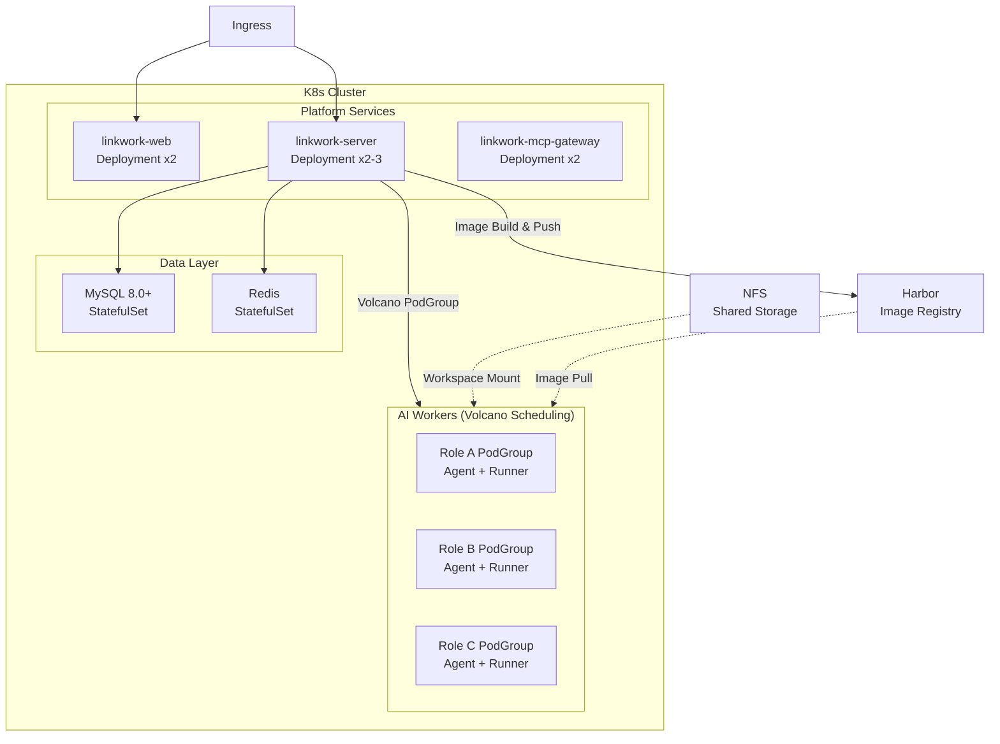

# Deployment Guide

LinkWork production deployment is based on Kubernetes clusters. This guide covers the full infrastructure requirements and deployment process.

---

## Infrastructure Requirements

### Cluster & Scheduling

| Dependency | Version Required | Description |
|-----------|-----------------|-------------|
| Kubernetes | v1.33+ | Container orchestration platform |
| Volcano Scheduler | v1.13.0+ | Gang Scheduling, atomic multi-container scheduling |
| kubectl | Matching K8s version | Cluster management tool |

> Volcano is used to implement PodGroup atomic scheduling for AI workers (`scheduling.volcano.sh/v1beta1`), ensuring that Agent and Runner containers are both scheduled successfully or both fail.

### Image Registry

| Dependency | Description |
|-----------|-------------|
| Harbor | Role image storage and distribution |

LinkWork's "One Role, One Image" mechanism requires each role to build an independent container image, pushed to Harbor and then pulled by K8s for execution. You need to:

- Deploy and configure a Harbor instance
- Create a project space (e.g., `linkwork/`)
- Configure image push credentials (Registry username/password)
- Create `imagePullSecrets` in the K8s cluster for pulling private images

```bash
# Create image pull secret (example)
kubectl create secret docker-registry harbor-secret \
  --docker-server=your-harbor.example.com \
  --docker-username=your-user \
  --docker-password=your-password \
  -n linkwork
```

### Data Layer

| Dependency | Version Required | Purpose |
|-----------|-----------------|---------|
| MySQL | 8.0+ | Business data storage (roles, tasks, users, etc.) |
| Redis | 7+ | Task queues, caching, approval workflows, data bus |
| NFS Shared Storage | — | AI worker workspaces, user files, role file persistence |

### Build Environment

| Dependency | Version Required | Purpose |
|-----------|-----------------|---------|
| Docker | 24.0+ | Role image building (requires Docker Socket mounted on server nodes) |

---

## Environment Planning

Recommended namespace isolation by environment:

| Environment | Namespace | Purpose |
|------------|-----------|---------|
| Development | `linkwork-dev` | Development and testing |
| Staging | `linkwork-staging` | Integration verification |
| Production | `linkwork-prod` | Production environment |

AI worker containers run in a dedicated namespace:

| Namespace | Purpose |
|-----------|---------|
| `ai-worker` | AI worker Pod execution space |

---

## Deployment Architecture



### AI Worker Pod Structure

Each AI worker is scheduled as a Volcano PodGroup, containing two containers:

| Container | Purpose | Description |
|-----------|---------|-------------|
| Agent | AI reasoning + SDK runtime | Calls LLM, orchestrates Skills, executes task logic |
| Runner | Command execution sandbox | Receives Agent commands via SSH, isolated execution environment |

```yaml
# Pod scheduling annotation example
metadata:
  annotations:
    scheduling.volcano.sh/group-name: svc-{serviceId}-pg
    volcano.sh/queue-name: ai-worker-default
spec:
  schedulerName: volcano
```

---

## Core Resource Configuration

### Platform Services

| Component | Replicas | CPU Request | Memory Request | CPU Limit | Memory Limit |
|-----------|----------|------------|----------------|-----------|-------------|
| linkwork-web | 2 | 200m | 256Mi | 1000m | 1Gi |
| linkwork-server | 2-3 | 500m | 512Mi | 2000m | 2Gi |
| linkwork-mcp-gateway | 2 | 200m | 256Mi | 1000m | 1Gi |

### AI Worker Containers

AI worker container resource quotas are determined by role configuration:

| Tier | CPU | Memory | Use Case |
|------|-----|--------|----------|
| Light | 500m | 512Mi | Document writing, simple analysis |
| Standard | 1000m | 1Gi | Code review, data analysis |
| High Performance | 2000m | 4Gi | Large project development, complex reasoning |

---

## Image Building & Distribution

LinkWork uses a "One Role, One Image" mechanism. The role build process:

1. **Admin configures the role** — Select Skills, MCP tools, security policies, resource quotas
2. **Trigger image build** — Server dynamically generates a Dockerfile, executes `docker build`
3. **Image distribution (choose one)**
   - `imageRegistry` configured: push the built image to remote registry
   - `imageRegistry` empty: keep image local and auto-sync only the current built image to Kind nodes (no bulk load of all host images)
4. **K8s pulls and runs** — During task scheduling, K8s pulls the role image from the configured source

Image naming convention: `{registry}/service-{serviceId}-agent:{serviceId}-{timestamp}`

Base image built on Rocky Linux 9, pre-installed with:

- Python 3.12, Node.js 24, Java 21, Go 1.22
- git, curl, jq, and other common tools
- Claude CLI, uv/uvx, and other AI development tools

### Local Image Ops (Kind)

In local-image mode, backend can auto-run image sync and cleanup. Recommended env vars:

```bash
LINKWORK_BUILD_LOCAL_LOAD_ENABLED=true
LINKWORK_BUILD_KIND_CLUSTER_NAME=shared-dev   # optional, auto-discover if empty
IMAGE_LOCAL_CLEANUP_ENABLED=true
IMAGE_LOCAL_RETENTION_HOURS=24
IMAGE_LOCAL_CLEANUP_CRON="0 40 * * * *"       # minute 40 of every hour
IMAGE_KIND_PRUNE_ENABLED=true
```

You can also trigger one maintenance run manually (without waiting for cron):

```bash
curl -X POST http://<linkwork-server>/api/v1/build/ops/local-image-maintenance
```

---

## Horizontal Scaling

| Component | Scaling Method | Description |
|-----------|---------------|-------------|
| linkwork-web | HPA | Auto-scale based on CPU / request count |
| linkwork-server | HPA | Auto-scale based on CPU / request count |
| linkwork-mcp-gateway | HPA | Auto-scale based on CPU / request count |
| AI Worker Containers | Volcano Queue | Adjust instance count based on role task volume; Volcano handles resource queuing and scheduling |

---

## Development Mode (Docker Compose)

If you only need to start the platform services (server + web) for development and debugging, you can use Docker Compose:

```bash
docker compose up -d
```

| Service | Port | Description |
|---------|------|-------------|
| linkwork-server | 8081 | Backend API |
| linkwork-web | 3003 | Frontend UI |

> This mode is only for local development of platform services. Creating and executing AI workers requires full K8s infrastructure.

---

## Further Reading

- [Quick Start](../quick-start.md) — Minimal startup experience
- [Extension Guide](./extension.md) — Learn about role and capability extension
