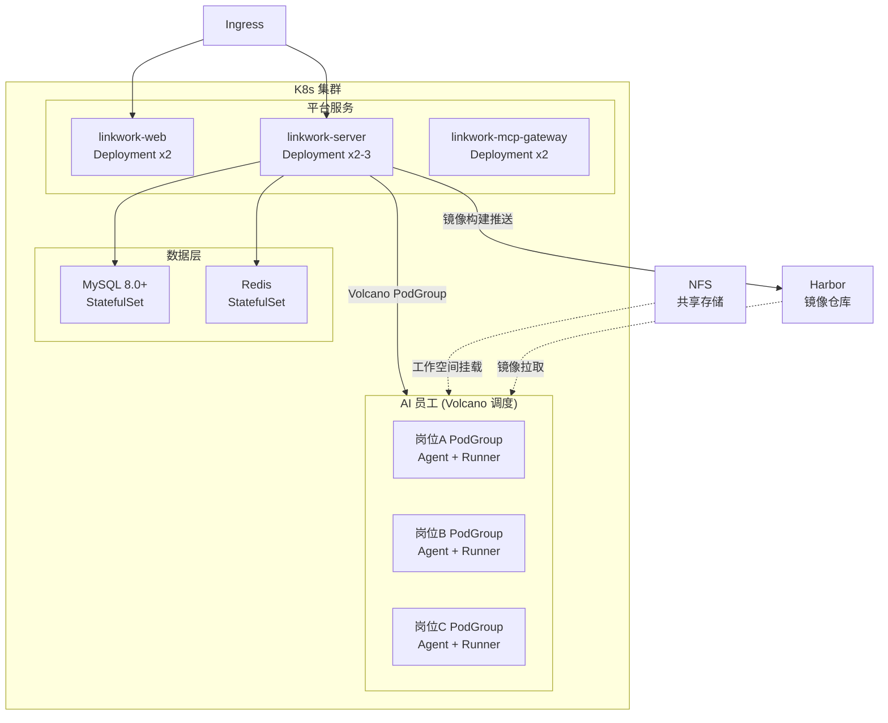

# 部署指南

LinkWork 的生产部署基于 Kubernetes 集群。本指南介绍完整的基础设施要求和部署流程。

---

## 基础设施要求

### 集群与调度

| 依赖 | 版本要求 | 说明 |
|------|---------|------|
| Kubernetes | v1.33+ | 容器编排平台 |
| Volcano 调度器 | v1.13.0+ | Gang Scheduling，多容器原子化调度 |
| kubectl | 对应 K8s 版本 | 集群管理工具 |

> Volcano 用于实现 AI 员工的 PodGroup 原子调度（`scheduling.volcano.sh/v1beta1`），确保 Agent 容器与 Runner 容器同时调度成功或同时失败。

### 镜像仓库

| 依赖 | 说明 |
|------|------|
| Harbor | 岗位镜像的存储与分发 |

LinkWork 的「一岗位一镜像」机制要求每个岗位构建独立的容器镜像，镜像推送到 Harbor 后由 K8s 拉取运行。你需要：

- 部署并配置 Harbor 实例
- 创建项目空间（如 `linkwork/`）
- 配置镜像推送凭证（Registry 用户名/密码）
- 在 K8s 集群中创建 `imagePullSecrets`，供 Pod 拉取私有镜像

```bash
# 创建镜像拉取凭证（示例）
kubectl create secret docker-registry harbor-secret \
  --docker-server=your-harbor.example.com \
  --docker-username=your-user \
  --docker-password=your-password \
  -n linkwork
```

### 数据层

| 依赖 | 版本要求 | 用途 |
|------|---------|------|
| MySQL | 8.0+ | 业务数据存储（岗位、任务、用户等） |
| Redis | 7+ | 任务队列、缓存、审批流、数据总线 |
| NFS 共享存储 | — | AI 员工工作空间、用户文件、岗位文件持久化 |

### 构建环境

| 依赖 | 版本要求 | 用途 |
|------|---------|------|
| Docker | 24.0+ | 岗位镜像构建（需要在 server 节点挂载 Docker Socket） |

---

## 环境规划

建议按环境隔离 Namespace：

| 环境 | Namespace | 用途 |
|------|-----------|------|
| 开发 | `linkwork-dev` | 开发测试 |
| 预发布 | `linkwork-staging` | 集成验证 |
| 生产 | `linkwork-prod` | 正式环境 |

AI 员工容器运行在独立的 Namespace 中：

| Namespace | 用途 |
|-----------|------|
| `ai-worker` | AI 员工 Pod 运行空间 |

---

## 部署架构



### AI 员工 Pod 结构

每个 AI 员工以 Volcano PodGroup 方式调度，包含两个容器：

| 容器 | 用途 | 说明 |
|------|------|------|
| Agent | AI 推理 + SDK 运行时 | 调用 LLM、编排 Skills、执行任务逻辑 |
| Runner | 命令执行沙箱 | 通过 SSH 接收 Agent 指令，隔离执行环境 |

```yaml
# Pod 调度注解示例
metadata:
  annotations:
    scheduling.volcano.sh/group-name: svc-{serviceId}-pg
    volcano.sh/queue-name: ai-worker-default
spec:
  schedulerName: volcano
```

---

## 核心资源配置

### 平台服务

| 组件 | 副本数 | CPU 请求 | 内存请求 | CPU 上限 | 内存上限 |
|------|--------|---------|---------|---------|---------|
| linkwork-web | 2 | 200m | 256Mi | 1000m | 1Gi |
| linkwork-server | 2-3 | 500m | 512Mi | 2000m | 2Gi |
| linkwork-mcp-gateway | 2 | 200m | 256Mi | 1000m | 1Gi |

### AI 员工容器

AI 员工容器的资源配额由岗位配置决定：

| 规格 | CPU | 内存 | 适用场景 |
|------|-----|------|---------|
| 轻量 | 500m | 512Mi | 文档撰写、简单分析 |
| 标准 | 1000m | 1Gi | 代码审查、数据分析 |
| 高性能 | 2000m | 4Gi | 大型项目开发、复杂推理 |

---

## 镜像构建与分发

LinkWork 采用「一岗位一镜像」机制，岗位构建流程：

1. **管理员配置岗位** — 选择 Skills、MCP 工具、安全策略、资源配额
2. **触发镜像构建** — server 动态生成 Dockerfile，执行 `docker build`
3. **镜像分发（二选一）**
   - 配置了 `imageRegistry`：构建完成后推送到远程仓库
   - 未配置 `imageRegistry`：仅保留本地镜像，并自动把“当前构建镜像”同步到 Kind 节点（不会全量同步主机所有镜像）
4. **K8s 拉取运行** — 任务调度时，从配置的镜像来源拉取对应岗位镜像创建 Pod

镜像命名规则：`{registry}/service-{serviceId}-agent:{serviceId}-{timestamp}`

基础镜像基于 Rocky Linux 9，预装：

- Python 3.12、Node.js 24、Java 21、Go 1.22
- git、curl、jq 等常用工具
- Claude CLI、uv/uvx 等 AI 开发工具

### 本地镜像运维动作（Kind）

后端在本地镜像模式下会自动执行镜像同步与清理，建议在环境变量中显式配置：

```bash
LINKWORK_BUILD_LOCAL_LOAD_ENABLED=true
LINKWORK_BUILD_KIND_CLUSTER_NAME=shared-dev   # 可选，不填则自动发现
IMAGE_LOCAL_CLEANUP_ENABLED=true
IMAGE_LOCAL_RETENTION_HOURS=24
IMAGE_LOCAL_CLEANUP_CRON="0 40 * * * *"       # 每小时第 40 分钟
IMAGE_KIND_PRUNE_ENABLED=true
```

并支持手动触发一次运维动作（立即执行，不等 cron）：

```bash
curl -X POST http://<linkwork-server>/api/v1/build/ops/local-image-maintenance
```

---

## 横向扩展

| 组件 | 扩展方式 | 说明 |
|------|---------|------|
| linkwork-web | HPA | 根据 CPU / 请求数自动扩缩 |
| linkwork-server | HPA | 根据 CPU / 请求数自动扩缩 |
| linkwork-mcp-gateway | HPA | 根据 CPU / 请求数自动扩缩 |
| AI 员工容器 | Volcano 队列 | 按岗位任务量调整实例数，Volcano 负责资源排队与调度 |

---

## 开发模式（Docker Compose）

如果只需要启动平台服务（server + web）进行开发调试，可以使用 Docker Compose：

```bash
docker compose up -d
```

| 服务 | 端口 | 说明 |
|------|------|------|
| linkwork-server | 8081 | 后端 API |
| linkwork-web | 3003 | 前端界面 |

> 此模式仅用于平台服务的本地开发，AI 员工的创建和执行需要完整的 K8s 基础设施。

---

## 延伸阅读

- [快速开始](../quick-start_zh-CN.md) — 最小化启动体验
- [扩展开发指南](./extension_zh-CN.md) — 了解岗位和能力扩展
